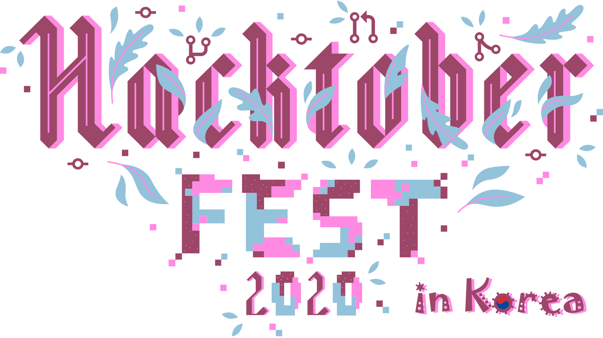

  
  <h1>
    Hacktoberfest Korea Site
  </h1>
  <a href="https://www.hacktoberfestkorea.com/">비공식 웹사이트</a> •
  <a href="https://www.facebook.com/groups/788404381916128">페이스북 그룹</a> •
  <a href="https://discord.gg/BD3V3NC">디스코드 서버</a>

 

> 많은 분들의 기여로 제작된 이 사이트는 '[www.hacktoberfestkorea.com](https://www.hacktoberfestkorea.com)'에서 확인하실 수 있습니다.

## 소개
한국어로 Hacktoberfest를 소개하고 정보를 나누는 사이트입니다.\
가급적 초보자 분들의 참여를 유도하고자 합니다.\
개발자 분들의 많은 참여를 부탁드립니다.

## 참고 가이드
풀리퀘스트(Pull Request)를 만드는데 익숙하지 않은 초보자분은 아래 가이드를 보시면 도움이 됩니다.

* [왕초보자 가이드](https://www.hacktoberfestkorea.com/super_beginners_guide/)
* [초보자 가이드](https://www.hacktoberfestkorea.com/beginners_guide/)

## 외부 링크
facebook 'Hacktoberfest Korea' 그룹과 discord 'Hacktoberfest Korea' 서버에서 Hacktoberfest와 관련된 정보를 공유하고 있습니다.
* [Facebook - hacktoberfest korea 그룹으로 가기](https://www.facebook.com/groups/788404381916128/?ref=share)
* [Discord - hacktoberfest korea 서버로 가기](https://discord.gg/BD3V3NC)
