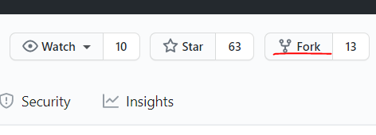
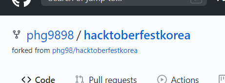
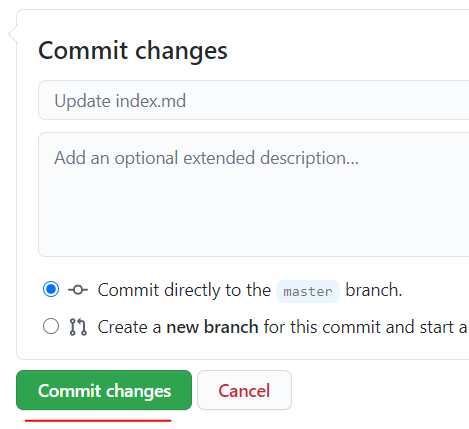
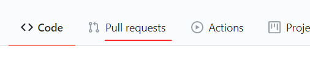
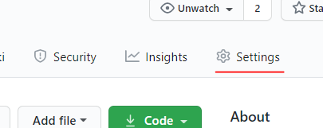
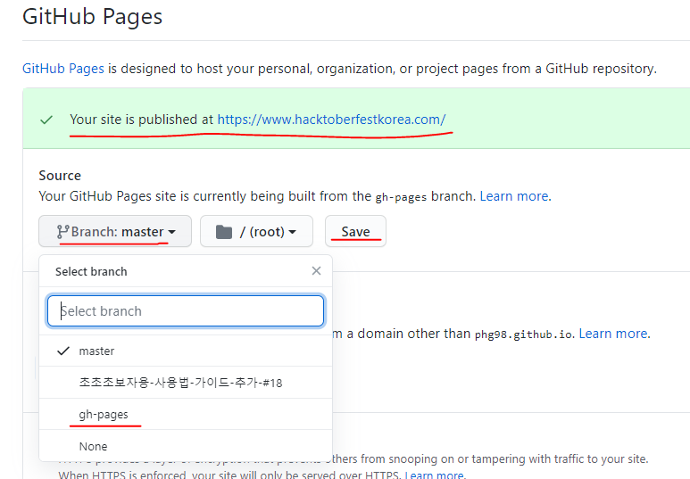

# 초보자용 사용 방법 
이 프로젝트는 프로그래밍을 몰라도 기여가 가능합니다.  
초보자분들도 오자수정이나 링크추가등을 10분만에 간단히 할 수 있습니다.  
아래 내용을 따라해 보세요.  

## 오자 찾기, 또는 링크 추가시
웹사이트에서 오자를 찾으셨다면 docs폴더의 파일들을 열어봅니다.    
웹사이트에 링크를 추가하고 싶으시다면 docs폴더의 index.md파일을 클릭해서 열어봅니다.    
만약 원하는 부분을 찾으셨다면 이 프로젝트를 본인의 계정으로 fork해서 수정해야 합니다.

## 본인의 계정으로 Fork하기
Fork는 일종의 복사작업 입니다.  
우상단의 'fork'버튼을 클릭합니다.  
  

fork가 끝나면 좌측상단에 저장소 이름이 표시됩니다. (phg9898대신에 본인계정이 표시되어야 합니다.)  
  

이제 프로젝트가 본인의 계정으로 복사된 것입니다.  
이제부터 수정이 가능합니다.

## 내용 수정하기
fork된 저장소에서 수정할 파일을 찾아 클릭합니다.  
파일내용이 표시되면 우측 상단의 연필 아이콘을 클릭하면 수정이 가능합니다.  
  

오자를 수정하거나 링크를 추가합니다.  
링크를 추가할 때에는 기존의 링크 형식을 보고 동일한 포맷으로 적으면 됩니다.  
수정을 완료한 후에는저장하기 위해 제일 아래의 'Commit changes'버튼을 누릅니다.  
  

수정된 내용은 본인의 계정에 저장된 것입니다. 이 수정사항을 원본 프로젝트에 반영하려면 풀리퀘스트(Pull Request)를 만들어야 합니다.

## 풀리퀘스트 만들기
'Pull Requests'탭을 클릭합니다.  
  

'New pull request' 버튼을 클릭합니다.  
  

이제 풀리퀘스트가 만들어졌습니다. 원본 프로젝트의 관리자가 승인하면 반영됩니다.  

## 승인을 기다리는 동안에...
내 계정에서도 웹사이트를 띄울 수 있습니다.  
'Settings'탭을 누릅니다.  
  

중간쯤의 'Github Pages'항목에서 'Branch:Master'버튼을 누르고 'gh-pages'를 선택한후 'save'버튼을 누릅니다.  
  

1분정도 기다리면 'Your site is published at https://<계정이름>.github.io/hacktoberfestkorea'라고 표시됩니다.  
링크부분을 클릭하면 웹사이트가 표시됩니다.  
아까 수정한 부분이 잘 반영되었는지 확인해 보세요.  

## 끝!
혹시 중간에 잘 안되는 부분이 있다면 인터넷 검색을 해보시고, 그래도 안된다면 phg98@naver.com으로 질문해 주세요.  
이제 첫 풀리퀘스트를 해보셨다면 [이슈페이지](https://github.com/phg98/hacktoberfestkorea/issues)로 가서 다른 적당한 항목이 있는지 확인해 보세요.  

### 참고 : 이 문서는 초보자를 위한 문서이므로 의도적으로 설명하지 않은 부분들이 있습니다. 
* 마크다운 문법
* 로컬PC로 Clone하여 수정하기
* 브랜치 생성하기
* 수정도중에 원본프로젝트의 변경사항 업데이트하기
* 커밋할때 좋은 메세지 작성하기
* Git 사용법 

천천히 하나씩 배워가시면 좋겠죠!
