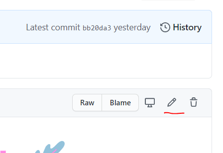
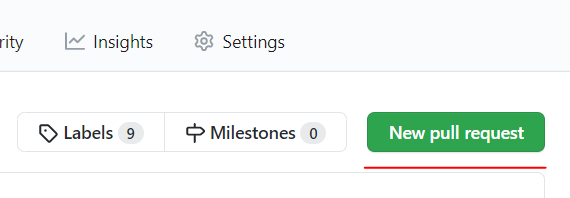

# 초보자용 사용 방법 
이 프로젝트는 프로그래밍을 잘 몰라도 기여가 가능합니다.  
첫 기여를 하고 싶다면 아래 내용을 따라해 보세요. 
* 이 문서는 2023년에 작성된 내용입니다. 개정이 필요하면 알려주세요 

## 오자 찾기, 또는 링크 추가시 {#find-misspelled-words-or-add-links}
웹사이트에서 오자를 찾으셨다면 docs폴더의 파일들을 열어봅니다.    
웹사이트에 링크를 추가하고 싶으시다면 docs폴더의 index.md파일을 클릭해서 열어봅니다.    
만약 원하는 부분을 찾으셨다면 이 프로젝트를 본인의 계정으로 fork해서 수정해야 합니다.

## 본인의 계정으로 Fork하기 {#fork-your-account}
'Fork'는 일종의 복사작업 입니다.  
우상단의 'Fork'버튼을 클릭합니다.  
  

Fork가 끝나면 본인의 깃헙 계정의 좌측상단에 저장소 이름이 표시됩니다. (phg9898대신에 본인계정이 표시되어야 합니다.)  
  

이제 프로젝트가 본인의 계정으로 복사된 것입니다.  
이제부터 수정이 가능합니다.

## 저장소 클론하기
터미널을 열고 본 저장소의 URL을 자신의 기기에 클론합니다.

```bash
git clone "저장소 이름"
```

## 브랜치 생성하기 {#create-branch}
컴퓨터에 복사한 저장소 디렉토리로 이동합니다.

```bash
cd "파일 이름"
```

그리고 다음 명령어를 입력하여 브랜치를 생성합니다.
```bash
git checkout -b 브랜치 이름
```

예시:
```bash
git checkout -b add-readme-file
```

## 내용 수정하기 {#to-modify-the-content}

Fork된 저장소에서 수정할 파일을 찾아 클릭합니다. 
파일 내용이 표시되면 우측 상단의 연필 아이콘을 클릭하면 수정이 가능합니다.  
  

오자를 수정하거나 링크를 추가합니다.  
링크를 추가할 때에는 기존의 링크 형식을 보고 동일한 포맷으로 적으면 됩니다.  
수정을 완료한 후에는 저장하기 위해 제일 아래의 'Commit changes'버튼을 누릅니다.  
  

수정된 내용은 본인의 계정에 저장된 것 입니다. 이 수정사항을 원본 프로젝트에 반영하려면 풀리퀘스트(Pull Request)를 만들어야 합니다.

추가: 브랜치 생성 후 코드를 통해 변경할 시에도 비슷합니다. 변경하고자 하는 내용을 추가 혹은 수정하고 아래의 명령어를 통해 추가합니다.
예시:
```bash
git add Readme.md
```

그 후 commit 명령어를 통해 변경사항을 저장하고 푸시합니다.
예시:
```bash
git commit -m "Update Readme.md"
```

```bash
git push origin 브랜치 이름
```

## 풀리퀘스트 만들기 {#create-pull-request}
'Pull Requests'탭을 클릭합니다.  
  

'New pull request' 버튼을 클릭합니다.  
  

이제 풀리퀘스트가 만들어졌습니다. 원본 프로젝트의 관리자가 승인하면 반영됩니다.  

## 끝! {#end}
혹시 중간에 잘 안되는 부분이 있다면 인터넷 검색을 해보시고, 그래도 안된다면 phg98@naver.com으로 질문해 주세요.  
이제 첫 풀리퀘스트를 해보셨다면 [이슈페이지](https://github.com/phg98/hacktoberfestkorea/issues)로 가서 다른 적당한 항목이 있는지 확인해 보세요.  

### 참고 : 이 문서는 초보자를 위한 문서이므로 의도적으로 설명하지 않은 부분들이 있습니다. {#reference}
* 마크 다운 문법
  * [마크다운 기본 문법](https://gist.github.com/ihoneymon/652be052a0727ad59601)
  * [마크다운 확장 문법](https://eatchangmyeong.github.io/syntax/)
* 수정도중에 원본프로젝트의 변경사항 업데이트하기
* 커밋할때 좋은 메세지 작성하기
* Git 사용법 

천천히 하나씩 배워가시면 좋겠죠!

# How to use it for beginners 
You don't need to know much programming to contribute to this project.  
If you'd like to make your first contribution, follow the steps below. 
* This document was written in 2023. Please let us know if it needs to be revised 

## Find misspellings, or add links {#find-misspelled-words-or-add-links}
If you find a typo on the website, open the files in the docs folder.    
If you want to add a link to your website, click and open the index.md file in the docs folder.    
Once you've found what you're looking for, you'll need to fork this project to your own account to make the changes.

## Fork to your account {#fork-your-account}
'Fork' is a kind of copying operation.  
Click the 'Fork' button in the upper right corner.  
  

When the fork is finished, you'll see the name of the repository in the top left corner of your GitHub account. (You should see your account instead of phg9898.)  
  

The project has now been copied to your account.  
You can modify it from now on.

## Cloning the repository
Open a terminal and clone the URL of this repository to your device.

```bash
git clone "repository name"
```

## Create a branch {#create-branch}
Navigate to the repository directory you copied to your computer.

```bash
cd "file name"
```

Then type the following command to create the branch.
```bash
git checkout -b branch name
```

Example:
```bash
git checkout -b add-readme-file
```

## To modify the content {#to-modify-the-content}

In the forked repository, find the file you want to modify and click it. 
When the file content is displayed, click the pencil icon in the top right corner to modify it.  
  

Correct a typo or add a link.  
When adding a link, simply view the existing link format and write it in the same format.
Once you've made your edits, hit the 'Commit changes' button at the bottom to save.  
  

Your modifications have been saved to your account. If you want this modification to be reflected in the original project, you will need to create Pull Requests.

Adding: Making changes through code after creating a branch is similar. Add or modify the changes you want to make and add them using the commands below.
Example:
```bash
git add Readme.md
```

Then, use the commit command to save and push your changes.
Example:
```bash
git commit -m "Update Readme.md"
```

```bash
git push origin branch name
```

## Create a pull request {#create-pull-request}
Click on the 'Pull Requests' tab.  
  


Click the 'New pull request' button.  
  


A pull request has now been created. Once it's approved by the admin of the original project, it will be reflected.  


## Done! {#end}
If you get stuck somewhere along the way, try googling it, and if that doesn't work, ask phg98@naver.com으로 questions.  
Now that you've made your first pull request, head over to the [이슈페이지](https://github.com/phg98/hacktoberfestkorea/issues) and see if there are any other suitable ones.  

### Note: This document is intended for beginners, so there are some things that are intentionally left unexplained. {#reference}
* Markdown syntax.
  * [Markdown basic syntax](https://gist.github.com/ihoneymon/652be052a0727ad59601)
  * [Markdown Extended Syntax](https://eatchangmyeong.github.io/syntax/)
* Updating changes to the original project while editing
* Writing a good message when committing
* How to use Git 

It's good to learn slowly and one by one!
* Write a nice message when committing
* How to use Git 

Learn slowly and one by one!