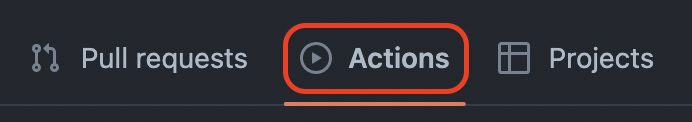
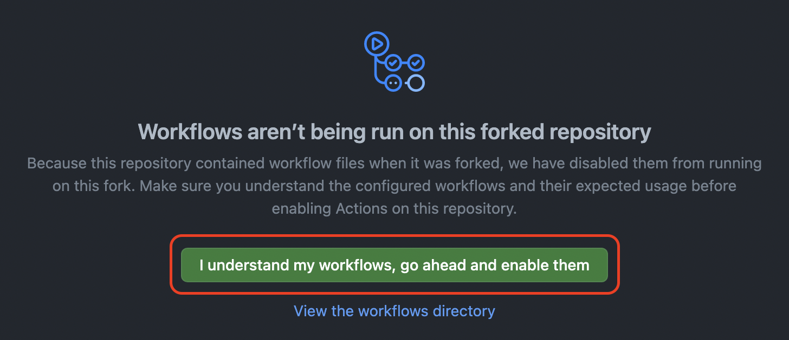

# 작업환경 구성하기
이 사이트는 Python과 mkdocs-material를 사용해 만들어졌습니다

## 공통 {#common}

아래 있는 모든 명령어는 cmd를 관리자 권한으로 실행 후 실행합니다

### GitHub 저장소 포크 {#gitHub-repository-fork}

```
phg98/hacktoberfestkorea --> [자신의GITHUB닉네임]/hacktoberfestkorea
```

### workflow 활성화하기 {#enable-workflow}
> 해당 단계를 실행하셔야 [작업환경 설정 방법 - GitHub](#how-to-set-up-a-work-environment)를 실행하실 수 있습니다.

포크한 github 저장소에서 좌상단의 'Actions'버튼을 클릭합니다.


workflow를 활성화하기 위해 아래의 초록색 버튼을 클릭합니다.


## 작업환경 설정 - Local {#local}

### 작업하고싶은 폴더로 이동 {#go-to-the-folder-you-want-to-work-with}

```
(예시)
cd C:\Users\a0103\Documents\hacktoberfestkorea
```

### 저장소 복제 {#replicate-storage}

```
git clone https://github.com/[자신의GITHUB닉네임]/hacktoberfestkorea.git
```

git clone 명령어 사용시 repository에 있는 모든 내용이

```
C:\Users\a0103\Documents\hacktoberfestkorea
```

에 저장됩니다 이 경로는 **예시**이며 빌드시 원하는 경로를 직접 선택하시면 됩니다

### Python 설치 {#python-installation}

[점프 투 파이썬 - 파이썬 설치하기](https://wikidocs.net/8)

### Material for MkDocs 설치 {#material-for-mkDocs-installation}

```
pip install mkdocs-material
```

설치 완료시(예시):

```
Successfully installed livereload-2.6.3 lunr-0.5.8 markdown-3.2.2 mkdocs-1.1.2 mkdocs-material-6.0.1 mkdocs-material-extensions-1.0.1 pymdown-extensions-8.0.1
```

### 작업폴더로 이동 {#go-to-the-job-folder}

```
(예시)
cd C:\Users\a0103\Documents\hacktoberfestkorea
```

### 웹사이트 확인하기 {#local-check-the-website}

```
mkdocs serve
```

명령어 실행후 [localhost:8000](localhost:8000)에 접속합니다

## 작업환경 설정 방법 - GitHub {#how-to-set-up-a-work-environment}

### GitHub Pages 사용 {#using-gitHub-pages}

GitHub 저장소 설정에 들어갑니다

[https://github.com/[자신의GITHUB닉네임]/hacktoberfestkorea/settings](https://github.com/[자신의GITHUB닉네임]/hacktoberfestkorea/settings)

하단에 있는 **GitHub Pages** 탭에서
Source를 None에서 gh-pages로 변경하고, 폴더를 /(root) 로 지정후 저장합니다

### 웹사이트 확인하기 {#github-check-the-website}

[https://[자신의GITHUB닉네임].github.io/hacktoberfestkorea](https://[자신의GITHUB닉네임].github.io/hacktoberfestkorea)에 접속합니다
