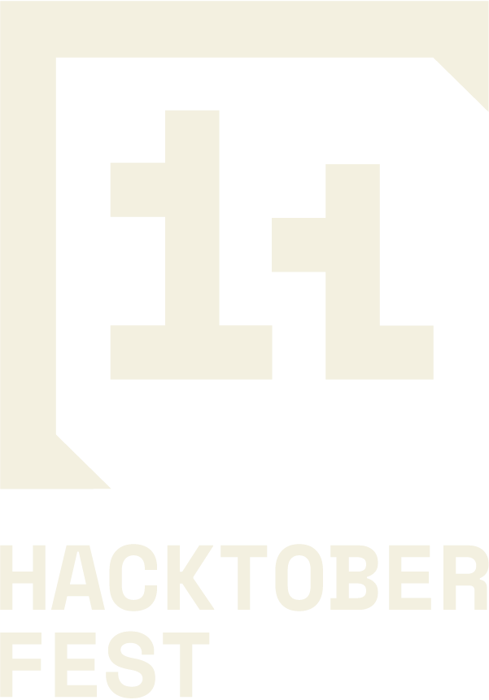

  <h1> Hacktoberfest는 매년 10월에 진행되는 글로벌 오픈소스 행사입니다! </h1>
  
 이 사이트는 한국 개발자들을 위한 <b>비공식(Unofficial)</b> 사이트 입니다. 

  
 자세한 내용은 공식 홈페이지를 참고하세요.

  <a target="_blank" id="button" class="md-button md-button--primary" href="https://hacktoberfest.com">공식 홈페이지로 가기</a>

## 핵토버페스트(Hacktoberfest)란?

- 2014년에 시작되어 올해로 13회째를 맞는 글로벌 오픈소스 행사입니다.
- 2026년부터는 [MLH(Major League Hacking)](https://mlh.io)와 [DEV](https://dev.to)가 주관하고, DigitalOcean이 후원합니다.
- 올해의 슬로건은 **"AI belongs to everyone"** 입니다. 오픈소스 AI와 오픈 웨이트(open-weight) 모델을 직접 만들고, 실험하고, 배우는 데 초점을 맞춥니다.

## 2026년에 달라진 점 {#whats-new-2026}

올해는 행사 방식이 크게 바뀌었습니다. 이전 연도 후기를 참고하실 때 유의하세요.

- **풀 리퀘스트 개수를 더 이상 세지 않습니다.** "10월에 PR 4개"라는 규칙은 사라졌습니다. AI 도구로 만든 저품질 PR이 늘어 메인테이너의 부담이 커진 것이 이유입니다.
- 대신 전 세계 **300개 이상의 오프라인·온라인 행사(Fest)** 가 중심입니다. 지역 개발자 커뮤니티가 모여 함께 만들고 배우는 방식입니다.
- Fest는 두 가지 형식이 있습니다.
    - **Hack Day**: 최대 12시간의 미니 해커톤. 공식 스왜그, 상 카테고리, DEV 배지, 파트너 상품이 있습니다.
    - **Meet Up**: 발표, 워크숍, 패널 토론 중심의 커뮤니티 모임. 공식 스왜그가 제공됩니다.
- **티셔츠는 보장되지 않습니다.** 오프라인 Fest 현장에서 재고가 있는 만큼만 배포되며, 온라인 참가자에게는 우편으로 보내지 않습니다.
- 온라인 참가자는 참여 마일스톤을 달성하면 스티커 등이 담긴 **Swag Envelope**를 받을 수 있습니다. 세부 조건은 공식 홈페이지에서 추후 안내됩니다.
- 참가 자격은 만 13세 이상이면 누구나 가능합니다.

자세한 내용은 [자주 묻는 질문](faq.md)과 [공식 FAQ](https://hacktoberfest.com/questions/)를 참고하세요.

## Hacktoberfest Seoul 2026 (오프라인 행사) {#hacktoberfest-seoul-2026}

한국에서는 MLH 공식 Fest로 **Hacktoberfest Seoul 2026**을 준비하고 있습니다. 오픈소스 첫 기여를 함께 시작하는 반나절 행사입니다.

| 항목 | 내용 |
|---|---|
| 일시 | 2026년 10월 17일(토) 오후 (예정, 장소 확정 후 변동될 수 있습니다) |
| 장소 | 서울 (확정 후 안내) |
| 형식 | Meet Up: 발표 세션, 첫 PR 만들기 핸즈온, 네트워킹 |
| 규모 | 50명 내외 |
| 대상 | 오픈소스 기여를 처음 시작하려는 개발자, 학생, 메인테이너 |
| 참가비 | 무료 |
| 참가 신청 | 준비 중 (신청은 MLH OrganizerHQ에서 받습니다. 링크가 확정되면 이 자리에 추가합니다) |

- 준비 과정은 [Hacktoberfest Seoul 2026 저장소](https://github.com/soulee-dev/hacktoberfest-korea-2026)에서 공개적으로 진행합니다. 연사, 멘토, 스폰서로 함께하고 싶으시면 저장소 이슈나 아래 디스코드로 연락해 주세요.
- 핸즈온에 참여하려면 GitHub 계정과 Git 설치가 필요합니다. [초보자용 가이드](beginners_guide.md)와 [작업환경 구성 방법](build.md)을 미리 읽어 오시면 좋습니다.
- 다른 지역의 Fest는 공식 홈페이지의 [Find a Fest](https://hacktoberfest.com/fests/)에서 찾을 수 있습니다.

## 이전 행사 참여 후기 {#review-of-previous-event-participation}

이전에 참여했던 분들 중 후기를 쓰셨던 분들은 아래에 링크해 주시면 새로운 사람들이 둘러보는데 도움이 되겠습니다. 2025년 이전 후기는 PR 개수를 세던 시절의 규칙을 기준으로 쓰였다는 점을 참고하세요.

2023년 후기

- '생활밀착형 개발자 밤팔이 블로그'의 [핵토버페스트 Hacktoberfest 2023 참가 후기](https://blog.naver.com/hyeonjun7/223261713829)

2022년 후기

- '코딩과 나 블로그'의 [핵토버페스트 Hacktoberfest 2022 참가 후기](https://bananajeong.tistory.com/730)
- '생활밀착형 개발자 밤팔이 블로그'의 [[Hacktoberfest] 핵토버페스트 2022](https://blog.naver.com/hyeonjun7/222899862893)
- 'mirusu400 블로그'의 [Hacktoberfest 2022 참가 후기](https://blog.naver.com/mirusu400/222921057382)

2021년 후기

- 'Mike Kim 개발 블로그'의 [2021 핵토버페스트 첫 참가기!](https://kys9261.github.io/2021/10/20/programming/life/2021-hacktoberfest/)
- 'Hello, world! 블로그'의 [Hacktoberfest 핵토버페스트 2021 후기](https://blog.naver.com/hyeonjun7/222690170733)
- _기존에 참여하셨었나요? 후기를 링크해서 공유해주세요! 링크하시려면 [여기](https://github.com/hacktoberfestkorea/hacktoberfestkorea/edit/master/docs/index.md)를 클릭하세요._

## 한글 프로젝트 {#hangul-project}

올해는 PR 개수를 세지 않지만, 오픈소스 기여는 1년 내내 할 수 있습니다. 첫 기여를 연습하기 좋은 한글 프로젝트를 모아 둡니다.

- [Hacktoberfest Korea](https://github.com/hacktoberfestkorea/hacktoberfestkorea) : 이 사이트의 저장소입니다. 연습하기 좋은 간단한 이슈들이 있습니다.
- [한국 WSL 사용자 그룹](https://www.wslhub.com/)
    - [WSL 시작하기](https://github.com/wslhub/wsl-firststep) : WSL을 설치하면서 처음에 하는 일들을 모아놓은 리포지터리입니다. 이곳에 WSL에 관련된 문서를 올려주시면 좋습니다. (난이도: 하)
    - [WSL SDK](https://github.com/wslhub/wsl-sdk-com) : WSL SDK COM 모듈 프로젝트입니다. 닷넷, COM 개발 경험이 있는 분의 컨트리뷰션을 받습니다. (난이도: 상)
    - [WSL Manager](https://github.com/wslhub/WslManager) : WSL 배포판을 GUI 방식으로 관리할 수 있는 윈도우용 애플리케이션입니다. (난이도: 중)
    - [WslQuery](https://github.com/wslhub/WslQuery) : WSL 배포판을 JSON 방식으로 조회하여 다른 프로그래밍 언어에서 활용하기 좋게 해줍니다. (난이도: 중)
- [닷넷데브](https://forum.dotnetdev.kr)
    - [식탁보 프로젝트](https://github.com/yourtablecloth/TableCloth) : 윈도우 샌드박스를 이용하여 인터넷 뱅킹, 공인 인증서 연동을 도와줍니다. 문서, 코드 기여를 받습니다. (난이도: 중상)
    - [식탁보 홈페이지](https://github.com/yourtablecloth/yourtablecloth.github.io) : 식탁보의 사용법에 관련된 문서 기여를 받습니다. (난이도: 하)
    - [식탁보 카탈로그](https://github.com/yourtablecloth/TableClothCatalog) : 인터넷 익스플로러가 아니면 제대로 동작하지 않는 사이트와 필요한 소프트웨어 EXE 파일 다운로드 경로를 카탈로그 형태로 관리하고 있습니다. (난이도: 중)
    - [Experimental.System.Messaging](https://github.com/dotnetdev-kr/Experimental.System.Messaging) : 닷넷 코어 (!= 닷넷 프레임워크)용 MSMQ 라이브러리이며, MS의 레퍼런스 소스를 이식해서 만들었습니다. 코드 기여, 샘플 코드, 문서 기여를 받습니다. (난이도: 상)
- [react-kakao-maps-sdk](https://github.com/JaeSeoKim/react-kakao-maps-sdk) : Kakao Map를 React 컴포넌트로 관리할 수 있게 랩핑한 라이브러리 입니다. 코드 기여, 샘플 코드, 문서 기여를 받습니다. (난이도: 중)
- [LibreOffice 우리말 자동교정](https://github.com/libreoffice-kr/autocorr_kr): 리브레오피스(LibreOffice)의 우리말 자동교정 내용을 관리하는 저장소입니다. 자동교정 대상 낱말과 변경할 낱말을 추가하는기능 기여를 받습니다. (난이도: 하)
- [reading_books_record_repository](https://github.com/saseungmin/reading_books_record_repository): 책을 읽고 정리한 Repository이고, [Summary book 웹사이트](https://saseungmin.github.io/reading_books_record_repository/)로 되어있습니다. 오탈자를 수정하지 않아 오탈자가 매우 많습니다. 초보자도 쉽게 오탈자를 찾아 수정하시고 기여할 수 있습니다. 기여 방법은 [여기](https://github.com/saseungmin/reading_books_record_repository#-%EC%BB%A8%ED%8A%B8%EB%A6%AC%EB%B7%B0%EC%85%98-%EB%B0%A9%EB%B2%95)를 참고해주세요. (난이도: 하)
- [Hacktoberfest Badge](https://github.com/phg98/hacktoberfest-badge): 핵토버페스트 PR을 몇개 올렸는지를 표시해주는 깃헙 프로필용 배지를 제공합니다 (난이도: 중하)
- [Next.js Starter](https://github.com/DavidYang2149/nextjs-starter) : Next.js에 테스트 도구를 추가한 보일러 플레이트입니다. 타입스크립트를 기본으로 하고 테스트를 위한 Jest, Testing Library 및 Cypress가 포함되어 있습니다. (난이도: 중하)
- _저장소를 운영하시는 분들 중에 참여하고자 하시는 분들은 [여기](https://github.com/hacktoberfestkorea/hacktoberfestkorea/edit/master/docs/index.md)를 클릭하세요. 올해에는 참여하지 않으신다면 링크 삭제 부탁드립니다. 응원합니다!_

[2021년 핵토버페스트에 참가했던 한글 프로젝트 링크](https://phg98.github.io/hacktoberfestkorea2021/#hangul-project)
[2020년 핵토버페스트에 참가했던 한글 프로젝트 링크](https://phg98.github.io/hacktoberfestkorea2020/#hangul-project)

## 영문 초보자용 프로젝트 {#a-project-for-beginners}

영어에 두려움이 없으시다면 아래의 초보자용 사이트를 참고하세요.

- [Good First Issue](https://goodfirstissue.dev/)
- [Awesome for Beginners](https://github.com/mungell/awesome-for-beginners)
- [Up For Grabs](https://up-for-grabs.net/#/)
- _좋은 영문 초보자용 프로젝트를 찾으셨나요? 링크해서 공유해주세요! 링크하시려면 [여기](https://github.com/hacktoberfestkorea/hacktoberfestkorea/edit/master/docs/index.md)를 클릭하세요._

## 현재 참여자 리스트 {#current-participant-list}

- 참여하시는 분들은 참여의사를 표시한 블로그, 저장소, 홈페이지 등을 링크해 주세요. 링크하시려면 [여기](https://github.com/hacktoberfestkorea/hacktoberfestkorea/edit/master/docs/index.md)를 클릭하세요. 5분이면 됩니다!

## 관련 링크 {#associated-link}

- 작년 내용을 보시려면 [2024년 자료](https://github.com/hacktoberfestkorea/hacktoberfestkorea/tree/2024)를 참고하세요. 2023년 자료는 [2023 Hacktoberfest Korea Unofficial](https://2023.hacktoberfestkorea.com)에 있습니다.
- 이 사이트의 Github 저장소 : [Hacktoberfest Korea](https://github.com/hacktoberfestkorea/hacktoberfestkorea)
- Hacktoberfest Seoul 2026 준비 저장소 : [hacktoberfest-korea-2026](https://github.com/soulee-dev/hacktoberfest-korea-2026)
- 페이스북 : [Hacktoberfest Korea Facebook](https://www.facebook.com/groups/788404381916128/)
- 디스코드 : [Hacktoberfest Korea Discord](https://discord.com/invite/BD3V3NC)
- 공식 주최 안내 : [Host a Fest](https://hacktoberfest.com/host/), [MLH Organizer Guide](https://mlh.gitbook.io/mlh-hacktoberfest-organizer-guide)
