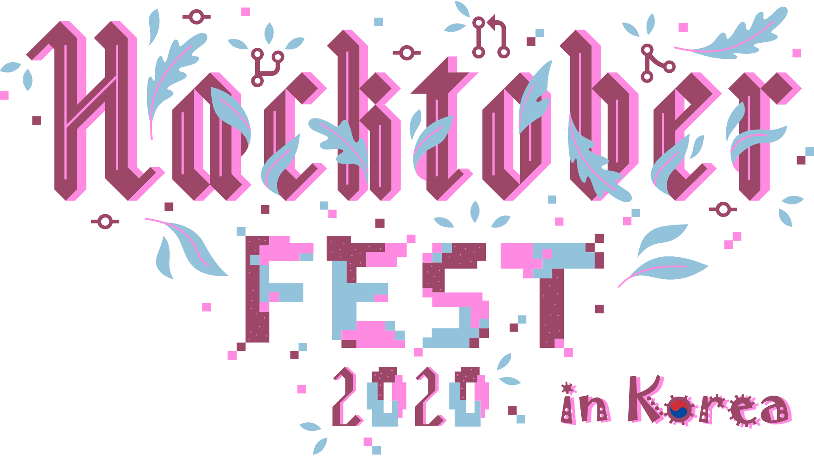

   <h1> Hacktoberfest는 오픈 소스를 지원하고,   멋진 티셔츠를 받을 수 있는 행사입니다! </h1>
   
 이 사이트는 한국 개발자들을 위한 <b>비공식(Unofficial)</b> 사이트 입니다. 

   
 행사에 등록하시려면 아래 공식 홈페이지로 가셔서 'Start Hacking'버튼을 누르세요. 

   [공식 홈페이지로 가기](https://hacktoberfest.digitalocean.com/){: .md-button .md-button--primary }
   

      
Presented by

       + 
       + 
      
   

<iframe src='https://www.youtube.com/embed/b_0rjUNK5zY' frameborder='0' allowfullscreen></iframe>

(한글자막 제공 : 이소울님)
 

## 행사 내용

Hacktoberfest®는 전세계 누구나 참여할 수 있는 행사입니다. 개발자, 학생, 행사주최자, 크고 작은 회사들 모두가 오픈 소스의 성장을 돕고 공동체에 긍정적인 기여를 할 수 있는 기회입니다. 다양한 배경과 다양한 기술 숙련도를 가진 분들 모두가 도전 가능합니다

- Hacktoberfest는 **전세계 누구나 참여가능한** 행사 입니다 .

- **Github에 호스팅된 공개 저장소중에서 hacktoberfest라는 topic을 가진 저장소**에 Pull Request 를 보내면 인정됩니다.[(10.3 업데이트)](hacktoberfest_spam_update.md)

- 10월 1일부터 10월 31일까지 보내진 Pull Request 만 인정됩니다.

## 행사 규칙
Hacktoberfest 티셔츠를 얻기 위해서는 먼저 행사 등록을 마친 후에 4개의 풀리퀘스트를 작성하면 됩니다. _GitHub의 퍼블릭저장소라면 어디에도 풀리퀘스트를 보내도 인정됩니다._( **업데이트! : 스팸PR을 방지하기 위해 'hacktoberfest'라는 topic이 붙어있는 저장소만 인정됩니다. 자세한 내용은 [스팸 PR 관련 공지](https://www.hacktoberfestkorea.com/hacktoberfest_spam_update/)를 참고 하세요.** ) 꼭 'Hacktoberfest'로 분류된 이슈가 아니어도 좋습니다. (만약 저장소소유자가 당신의 풀리퀘스트를 스팸이나 부적절하다고 신고할 경우 참가자격을 박탈당하게 됩니다.) 올해에는 조건을 만족하는 70,000명에게만 티셔츠가 보내집니다.  
행사참여에 대한 자세한 내용은 [세부사항](details.md) 및 [자주 묻는 질문](faq.md)을 참고하세요.

## 이전 행사 참여 후기

이전에 참여했던 분들중 후기를 쓰셨던 분들은 아래에 링크해 주시면 새로운 사람들이 둘러보는데 도움이 되겠습니다.

- '코드리뷰, 좀 쉬운 방법은 없을까? 블로그'의 2018년 [Hacktoberfest참가 후기](https://blog.naver.com/phg98/221374231575)
- '플라네타리움 엔지니어링 스낵'의 2019년 [저희와 함께 Hacktoberfest에 참가해봅시다!](https://snack.planetarium.dev/kor/2019/09/hacktoberfest/)
- '허원철의 개발 블로그'의 2019년 [2019 컨트리뷰톤 (feat. Armeria)](https://heowc.dev/2019/11/04/2019-contributon-feat-armeria/)
- '매일 성장하기 블로그'의 2018년 [Hacktoberfest 2018 후기](https://edykim.com/ko/post/hacktoberfest-2018/)
- 'amoseui 블로그'의 2018년 [Hacktoberfest 2018 후기](https://blog.amoseui.com/posts/hacktoberfest-2018)
- _기존에 참여하셨었나요? 후기를 링크해서 공유해주세요! 링크하시려면 [여기](https://github.com/phg98/hacktoberfestkorea/edit/master/docs/index.md)를 클릭하세요._

## 한글 프로젝트

- [Hacktoberfest Korea](https://github.com/phg98/hacktoberfestkorea) 초보자를 위한 간단한 이슈들이 있습니다.
- [LibreOffice우리말모듬의 자동교정데이터 저장소](https://github.com/libreoffice-kr/autocorr_kr) 리브레오피스의 우리말 자동교정 내용을 관리하는 저장소입니다.
- [p5sample](https://github.com/phg98/phg98p5sample) p5.js를 사용한 기하학 패턴 만들기. 실행화면은 [여기를 눌러보세요](https://phg98.github.io/phg98p5sample/)
- [KoNLPy: 파이썬 한국어 NLP](https://github.com/konlpy/konlpy) `한국어 정보처리를 위한 파이썬 패키지입니다.`
- [dragonEditor](https://github.com/lovefields/dragonEditor) `Javascript를 이용한 이지윅 에디터 오픈소스 입니다.`
- _저장소를 운영하시는 분들중에 참여하고자 하시는 분들은 [여기](https://github.com/phg98/hacktoberfestkorea/edit/master/docs/index.md)를 클릭하세요. 저장소에 ''hacktoberfest'라는 topic을 꼭 넣어주시구요.([참고 : 스팸 PR 관련 공지](https://www.hacktoberfestkorea.com/hacktoberfest_spam_update/)) 응원합니다!_
<!-- 가능하면 한글로 된 이슈에는 "핵토버페스트"라는 한글 라벨도 붙여주시면 찾기 좋을것 같습니다. -->
<!-- 저장소 운영하시는 분들은 다들 잘 아실테니까 설명 필요없을것 같은데, 혹시 초보자인데 등록하시려면 아래 내용대로만 하면 됩니다. -->
<!-- 기존 내용중 한 줄 복사하여 마지막줄에 붙여넣기 하신후 내용을 본인것에 맞게 수정해 주세요 -->
<!-- 수정이 끝나면 제일 아래에 Propose changes라는 녹색 버튼을 꾹 누르세요! -->
<!-- 수정하신 후에는 아래에 Propose changes라는 녹색 버튼을 꾹 누르세요! -->
<!-- 그럼 뭔가 복잡한 화면이 나오는데 또 다시 'Create Pull Request'라는 녹색 버튼을 꾹 누르세요! -->
<!-- 그럼 더 복잡한 화면이 나오는데.. 또 다시 'Create Pull Request'라는 녹색 버튼을 꾹 누르세요! -->
<!-- 그럼 뭔가 더 해야할 것 같은 화면이 나오는데, 안해도 됩니다. 사이트관리자가 승인하면 게시되구요, 링크가 깨진다던지 문제가 있다면 연락이 옵니다. -->

## 영문 초보자용 프로젝트

영어에 두려움이 없으시다면 아래의 초보자용 사이트를 참고하세요.  
[공식홈페이지](https://hacktoberfest.digitalocean.com/)에서 더 많은 프로젝트를 찾을 수 있습니다.

- [super-newbie coder's GUIDE TO Hacktoberfest](https://emmalearnscode.github.io/guide-to-HF/index.html) : html과 css파일만 추가하면 된다고 하네요.
- _좋은 영문 초보자용 프로젝트를 찾으셨나요? 링크해서 공유해주세요! 링크하시려면 [여기](https://github.com/phg98/hacktoberfestkorea/edit/master/docs/index.md)를 클릭하세요._
<!-- 기존 내용중 한 줄 복사하여 마지막줄에 붙여넣기 하신후 내용을 본인것에 맞게 수정해 주세요 -->
<!-- 수정이 끝나면 제일 아래에 Propose changes라는 녹색 버튼을 꾹 누르세요! -->
<!-- 수정하신 후에는 아래에 Propose changes라는 녹색 버튼을 꾹 누르세요! -->
<!-- 그럼 뭔가 복잡한 화면이 나오는데 또 다시 'Create Pull Request'라는 녹색 버튼을 꾹 누르세요! -->
<!-- 그럼 더 복잡한 화면이 나오는데.. 또 다시 'Create Pull Request'라는 녹색 버튼을 꾹 누르세요! -->
<!-- 그럼 뭔가 더 해야할 것 같은 화면이 나오는데, 안해도 됩니다. 사이트관리자가 승인하면 게시되구요, 링크가 깨진다던지 문제가 있다면 연락이 옵니다. -->

## 현재 참여자 리스트 
- [phg98](https://blog.naver.com/phg98/222101443689)
- [oouuyab](https://github.com/oouuyab)
- [modolee](https://velog.io/@modolee/hacktoberfest-2020)
- [h5jam](https://github.com/h5jam)
- [AkiaCode](http://github.com/AkiaCode)
- [minhoryang](https://github.com/minhoryang)
- [jehunseo](https://github.com/jehunseo)
- [kkimke](https://github.com/kkimke)
- [lill74](https://github.com/lill74)
- [pmh-only](https://github.com/pmh-only)
- [Limm-jk](https://limm-jk.tistory.com/26)
- [sboh1214](https://github.com/sboh1214)
- 참여하시는 분들은 참여의사를 표시한 블로그, 저장소, 홈페이지 등을 링크해 주세요. 링크하시려면 [여기](https://github.com/phg98/hacktoberfestkorea/edit/master/docs/index.md)를 클릭하세요.  5분이면 됩니다!
<!-- 기존 내용중 한 줄 복사하여 마지막줄에 붙여넣기 하신후 내용을 본인것에 맞게 수정해 주세요 -->
<!-- 수정이 끝나면 제일 아래에 Propose changes라는 녹색 버튼을 꾹 누르세요! -->
<!-- 그럼 뭔가 복잡한 화면이 나오는데 또 다시 'Create Pull Request'라는 녹색 버튼을 꾹 누르세요! -->
<!-- 그럼 더 복잡한 화면이 나오는데.. 또 다시 'Create Pull Request'라는 녹색 버튼을 꾹 누르세요! -->
<!-- 그럼 뭔가 더 해야할 것 같은 화면이 나오는데, 안해도 됩니다. 사이트관리자가 승인하면 게시되구요, 링크가 깨진다던지 문제가 있다면 연락이 옵니다. -->

## 관련 링크

- 이 사이트의 Github 저장소 : [Hacktoberfest Korea](https://github.com/phg98/hacktoberfestkorea)
