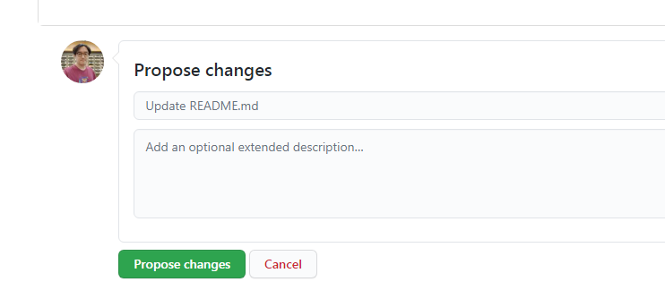
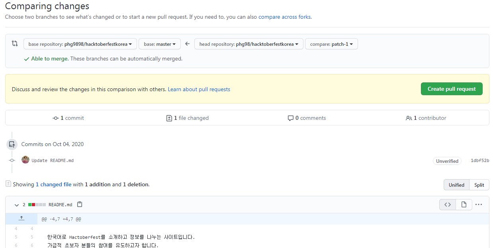

# 왕초보자용 사용 방법 
이 프로젝트는 프로그래밍을 몰라도 기여가 가능합니다.  
초보자분들도 오자수정이나 링크추가등을 10분만에 간단히 할 수 있습니다.  
아래 내용을 따라해 보세요.  

## 오자 찾기, 또는 링크 추가시 {#find-misspelled-words-or-add-links}
웹사이트에서 오자를 찾으셨다면 docs폴더의 파일들을 열어봅니다.    
웹사이트에 링크를 추가하고 싶으시다면 docs폴더의 index.md파일을 클릭해서 열어봅니다.    
만약 원하는 부분을 찾으셨다면 수정하러 갑시다.

## 내용 수정하기 {#to-modify-the-content}
파일내용이 표시되면 우측 상단의 연필 아이콘을 클릭하면 수정이 가능합니다.  
  

오자를 수정하거나 링크를 추가합니다.  
링크를 추가할 때에는 기존의 링크 형식을 보고 동일한 포맷으로 적으면 됩니다.  
수정을 완료한 후에는 저장 및 반영요청 하기 위해 제일 아래의 'Propose changes'버튼을 누릅니다.  
  

그러면 뭔가 복잡한 화면이 나옵니다. 수정내용을 한번 더 확인하는 화면입니다. 그냥 'Create pull request' 초록색 버튼을 클릭하세요.  
  

그러면 또다시 복잡한 화면이 나옵니다. 변경요청을 발송하는 화면입니다. 그냥 'New pull request' 초록색 버튼을 클릭합니다.  
  

이제 변경요청(풀리퀘스트Pull Request)가 만들어졌습니다. 기다리시면 원본 프로젝트의 관리자가 승인하면 반영됩니다.  
하단의 Close Pull Request버튼을 누르지 마세요. 그냥 화면 닫으시면 됩니다.

## 다음 단계 {#next-step}
이 방법은 간단하지만 본인의 저장소에 코드가 남지 않아서 매번 원본저장소에 와서 고쳐야 합니다.
다음 단계로는 [초보자용 사용 방법](beginners_guide.md)를 읽어 보세요!

### 참고 : 이 문서는 초초초초보자를 위한 문서이므로 의도적으로 설명하지 않은 부분들이 있습니다. {#reference}
* 마크 다운 문법
  * [마크다운 기본 문법](https://www.notion.so/MD-Markdown-md-6f90928d5b8a4884b84a540410f8afdd)
  * [마크다운 확장 문법](https://www.notion.so/MD-Markdown-md-c990b53525f3443faa2dc0f292222407)
* 본인저장소로 Fork하기
* 로컬PC로 Clone하여 수정하기
* 브랜치 생성하기
* 수정도중에 원본프로젝트의 변경사항 업데이트하기
* 커밋할때 좋은 메세지 작성하기
* Pull Request 만들기
* 리뷰 시스템 사용 
* Git 사용법 

천천히 하나씩 배워가시면 좋겠죠!
